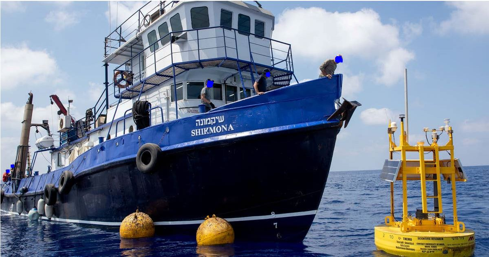
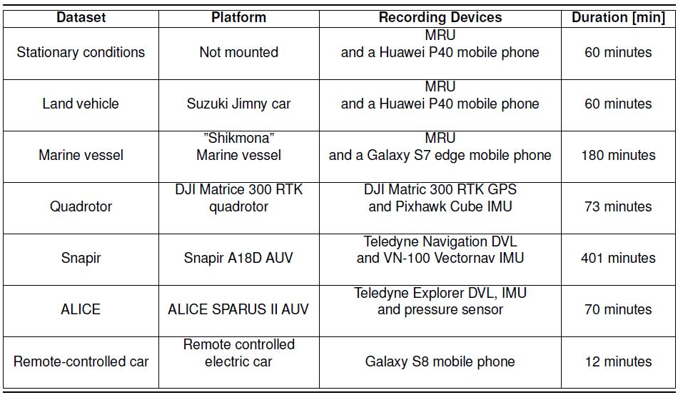

# Intro
This repository comes along with the "The Autonomous Platform Inertial Dataset" paper by The Hatter Department of Marine Technologies, University of Haifa,Haifa, Israel.\
You can find it here (to be added when archived)

The link to Google Drive with the data is: https://drive.google.com/drive/folders/1sbuDlklDdCfcQ0Y6brWcfGyv2iaIlCSU?usp=sharing.

# Navigation-Data-Project
 This paper presents the autonomous platforms inertial dataset. It contains inertial sensor raw data and corresponding ground truth trajectories. The dataset was collected using a variety of platforms including a quadrotor, two autonomous underwater vehicles, a land vehicle, a remote controlled electric car, and a boat. A total of 805.5 minutes of recordings were made using different types of inertial sensors, global navigation satellite system receivers, and Doppler velocity logs.  After describing the sensors that were employed for the recordings, a detailed description of the conducted experiments is provided. The autonomous platform inertial dataset is available at https://drive.google.com/drive/folders/1sbuDlklDdCfcQ0Y6brWcfGyv2iaIlCSU?usp=sharing.

# A Summarizing table of the recordings

